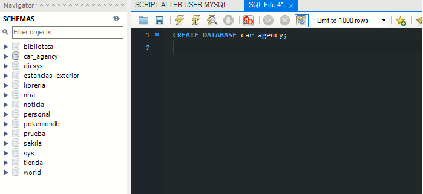
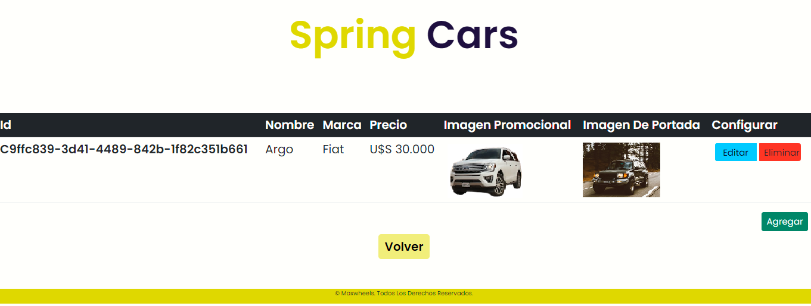

# AGENCIA DE AUTOS
Proyecto Backend utilizando un modelo de plantilla web de una agencia de autos ficticia, adaptándola a las necesidades del proyecto. El usuario previamente debe hacer login, según el rol del usuario será el permiso de acceso a las diferentes páginas:

*	ADMINISTRADOR: Tiene acceso a todas las páginas, especialmente a la sección de control. En la sección de control el usuario 'ADMIN' puede agregar, modificar y/o eliminar los datos de un auto.

*	USUARIO NORMAL: Este usuario no tiene permiso para acceder a la página de control, pero puede ver todos los detalles promocionales de los autos de las demás páginas.

## Instrucciones

Se debe primero registrar un usuario en un formulario modal, por defecto será un usuario con rol 'USER' (en el gestor de MySQL Workbench se puede modificar el rol del usuario registrado a 'ADMIN'), previo a esto se debe crear una base de datos en MySQL Workbench con el nombre 'car_agency'.

Para cargar un auto se debe completar el formulario modal del botón de agregar:

En el mismo repositorio hay una carpeta "Autos" para colocar las imagenes de los estilos de un auto, junto con la imagen promocional y la imagen de portada. En el select de 'colores' se puede agregar entre 3 y 5 colores. Según el orden de los colores elegidos en el select es el orden en el que se deben subir los estilos de los archivos de las imágenes.

## Capturas de algunas secciones de la página web

## Tecnologías utilizadas

